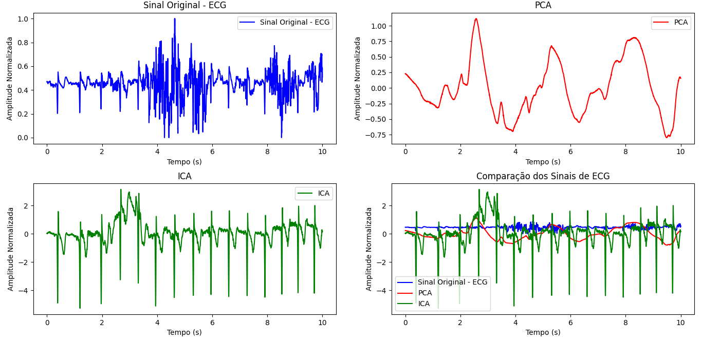

# ESTRATÉGIAS DE MINERAÇÃO DE DADOS PARA A ATENUAÇÃO DE ARTEFATOS EM ECG DE WEARABLES: APRIMORANDO A QUALIDADE DO SINAL PARA DIAGNÓSTICO CLÍNICO.

Este ensaio científico é fundamentado na aplicação de técnicas de mineração de dados e se aprofunda em uma investigação sobre o uso de duas abordagens de análise de sinais, a saber, Análise de Componentes Principais (PCA) e Análise de Componentes Independentes (ICA), na atenuação de artefatos presentes nos registros de Eletrocardiograma (ECG) provenientes de tecnologia vestível. Uma vez que a coleta de registros é suscetível a interferências, tais técnicas emergem como instrumentos significativos para aprimorar a interpretação dessas, especialmente quando descobertas por meio de dispositivos portáteis. Além da remoção de artefatos, a aplicação de técnicas de mineração de dados no processamento de ECGs vestimentais possibilita a remoção de padrões relevantes, a redução de ruídos e a melhoria na confiabilidade da análise dos sinais. A PCA, ao reduzir a dimensionalidade dos dados, permite identificar as características mais significativas do sinal cardíaco, enquanto a ICA se destaca na separação de fontes independentes, isolando interferências externas e artefatos fisiológicos. A integração dessas abordagens com algoritmos de mineração de dados viabiliza uma análise automatizada e escalável, favorecendo a identificação precoce de anomalias cardíacas e aprimorando o suporte a diagnósticos clínicos. Essa sinergia entre mineração de dados e análise de sinais biomédicos torna os wearables cada vez mais eficazes no monitoramento contínuo da saúde cardiovascular, ampliando sua aplicabilidade em cenários ambulatoriais e hospitalares.
Este projeto explora a aplicação de técnicas de Análise de Componentes Principais (PCA) e Análise de Componentes Independentes (ICA) para reduzir artefatos em sinais de Eletrocardiograma (ECG) obtidos por dispositivos vestíveis. O estudo utiliza dados do conjunto **ScientISST MOVE** para avaliar a eficácia dessas técnicas em ambientes dinâmicos.

  
*Figura 1: Comparação do sinal original de ECG com os resultados de PCA e ICA.*

---

## Sumário
1. [Visão Geral do Projeto](#visão-geral-do-projeto)
2. [Fundamentação Teórica](#fundamentação-teórica)
3. [Metodologia](#metodologia)
4. [Resultados](#resultados)
5. [Discussão e Conclusão](#discussão-e-conclusão)
6. [Como Reproduzir o Estudo](#como-reproduzir-o-estudo)
7. [Reconhecimentos e Direitos Autorais](#reconhecimentos-e-direitos-autorais)
8. [Copyright/License](#copyright/license)
---

## Visão Geral do Projeto
**Objetivo**:  
Reduzir artefatos de movimento em sinais de ECG coletados por dispositivos vestíveis, aprimorando a precisão para diagnóstico clínico.

**Problema**:  
Dispositivos vestíveis enfrentam interferências (e.g., movimentos corporais), que distorcem os sinais de ECG.  

**Técnicas Utilizadas**:  
- **Pré-processamento**
- **Processamento**
- **PCA:** Simplifica os dados identificando componentes de maior variância.
- **ICA:** Separa fontes estatisticamente independentes no sinal.

**Base de Dados**:  
[ScientISST MOVE](https://physionet.org/content/scientisst-move-biosignals/1.0.0/) (PhysioNet), contendo registros de ECG, EMG, PPG e acelerômetros durante atividades cotidianas.

---

## Fundamentação Teórica
### **MINERAÇÃO DE DADOS:** 
A mineração de dados é crucial para melhorar a qualidade dos sinais de eletrocardiograma (ECG) capturados por dispositivos vestíveis. Esses sinais frequentemente contêm artefatos causados por ruídos ambientais, movimentos do usuário e outras atividades fisiológicas. Estratégias como a análise de componentes principais (PCA) e a análise de componentes independentes (ICA) são utilizadas para identificar e atenuar esses artefatos, resultando em sinais de ECG mais puros e interpretáveis.A aplicação dessas técnicas de mineração de dados tem um impacto significativo na prática clínica, proporcionando leituras de ECG mais precisas e confiáveis. Isso facilita o diagnóstico e o monitoramento contínuo de condições cardiovasculares. Além disso, a integração dessas técnicas com inteligência artificial automatiza o processo de análise, tornando-o mais eficiente e acessível.O pré-processamento de sinais de eletrocardiograma (ECG) é uma etapa crucial para garantir a qualidade dos dados antes da aplicação de técnicas mais avançadas de mineração de dados. O objetivo do pré-processamento é preparar o sinal bruto, atenuando ou eliminando artefatos e ruídos que possam comprometer a análise subsequente.

### PCA (Análise de Componentes Principais)
- **Função**: Reduz dimensionalidade preservando a variância máxima.
- **Aplicação no ECG**: Identifica padrões dominantes (e.g., batimentos cardíacos) e atenua ruídos de baixa variância.

### ICA (Análise de Componentes Independentes)
- **Função**: Isola fontes independentes misturadas no sinal.
- **Aplicação no ECG**: Separa o sinal cardíaco de interferências (e.g., movimento muscular).

---

## Metodologia
### Fluxo do Projeto
1. **Coleta de Dados**:
- Dados do ScientISST MOVE (10.5 horas de registros de 17 voluntários).
- Atividades: caminhar, correr, gestos, etc.

3. **Pré-processamento**:  
- Carregar o Arquivo EDF: O arquivo EDF contendo os dados de ECG é carregado na memória usando a biblioteca mne.
- Definir o Intervalo de Tempo: Define-se o intervalo de tempo de interesse para focar nos primeiros 10 segundos dos dados de ECG.
- Obter os Dados: Extrai-se os dados brutos de ECG do objeto raw.
- Normalizar os Sinais: Os sinais são normalizados para ter amplitudes iguais, dividindo cada sinal pelo seu valor absoluto máximo. Isso garante que todos os sinais estejam na mesma escala.
- Calcular Características: Calcula-se a média, variância, mediana e curtose dos sinais normalizados, o que pode ser útil para análise e interpretação dos dados.

4. **Processamento:**
   **Aplicação de PCA e ICA**:  
- **PCA**: Seleção de componentes principais que explicam 95% da variância.A Análise de Componentes Principais (PCA) é aplicada aos dados normalizados para reduzir a dimensionalidade, identificando os componentes principais que explicam a maior parte da variância nos dados.
- **ICA**: Uso do algoritmo FastICA para extrair componentes independentes. A Análise de Componentes Independentes (ICA) é aplicada para decompor os dados normalizados em componentes independentes, separando as fontes independentes presentes no sinal de ECG.

5. **Plotagem dos Sinais:** Quatro gráficos são gerados para visualizar os diferentes sinais de ECG:
- Sinal original
- Sinal processado pelo PCA
- Sinal processado pelo ICA
- Comparação entre os três sinais
     
---

## Resultados
### Comparação Visual dos Sinais
- **PCA**: Preserva a estrutura geral do ECG, mas suaviza detalhes.
- **ICA**: Isola efetivamente o sinal cardíaco de artefatos (e.g., movimento).


---

## Discussão e Conclusão
**Principais Conclusões**:  
- **PCA**: Ideal para simplificação rápida, mas perde detalhes sutis.
- **ICA**: Superior na separação de fontes, porém computacionalmente intensivo.
- A investigação metodológica evidencia a importância de selecionar técnicas de mineração de dados apropriadas com base nos objetivos da análise e nas características do sinal. A inovação contínua e o aprimoramento dessas técnicas são essenciais para o desenvolvimento de dispositivos vestíveis mais eficazes no monitoramento da saúde cardiovascular. A incorporação de dispositivos vestíveis é fundamental para aprimorar a precisão na monitorização contínua do ECG, tornando-se um componente essencial na busca por resultados mais precisos e confiáveis no monitoramento cardíaco. Esses avanços têm o potencial de revolucionar a interpretação de registros cardíacos, contribuindo para a melhoria da saúde cardiovascular dos pacientes e aprimorando a qualidade dos diagnósticos clínicos. 

**Trabalho Futuro**:  
Combinação de PCA/ICA com redes neurais para classificação de anomalias.

---

## Como Reproduzir o Estudo
### Requisitos
- Python 3.13
- Bibliotecas: `mne`, `numpy`, `scikit-learn`, `matplotlib`

### Passos
1. **Clonar o Repositório**:  
   ```bash
   git clone https://github.com/hreis1/data-mining.git
   cd data-mining
   ```

2. **Executar o Código**:  
   ```bash
   python3.13 Codigos/main.py
   ```
---

## Reconhecimentos e Direitos Autorais

- **@autor**: Paulo Henrique Reis | Renata Costa Rocha
- **@contato**: hreispaulo1@gmail.com | renata.rocha@discente.ufma.br
- **@data última versão**: 30/01/2025
- **@versão**: 0.1
- **outros repositórios**: [ScientISST-MOVE](https://github.com/scientisst/ScientISST-MOVE)
- **Agradecimentos**: Universidade Federal do Maranhão (UFMA), Professor Doutor Thales Levi Azevedo Valente, e colegas de curso.
---

## Copyright/License

Este material é resultado de um trabalho acadêmico para a disciplina **Mineração de Dados e Aplicações na Engenharia,** sob a orientação do professor **Dr. Thales Levi Azevedo Valente,** semestre letivo **2024.2,** curso **Engenharia da Computação,** na **Universidade Federal do Maranhão (UFMA)**.

Este material é resultado de um trabalho acadêmico para a disciplina MINERAÇÃO DE DADOS E APLICAÇÕES NA ENGENHARIA, sob a orientação do professor Dr. THALES LEVI AZEVEDO VALENTE, semestre letivo 2024.2, curso Engenharia da Computação, na Universidade Federal do Maranhão (UFMA). Todo o material sob esta licença é software livre: pode ser usado para fins acadêmicos e comerciais sem nenhum custo. Não há papelada, nem royalties, nem restrições de "copyleft" do tipo GNU. Ele é licenciado sob os termos da Licença MIT, conforme descrito abaixo, e, portanto, é compatível com a GPL e também se qualifica como software de código aberto. É de domínio público. Os detalhes legais estão abaixo. O espírito desta licença é que você é livre para usar este material para qualquer finalidade, sem nenhum custo. O único requisito é que, se você usá-los, nos dê crédito.

Licenciado sob a Licença MIT. Permissão é concedida, gratuitamente, a qualquer pessoa que obtenha uma cópia deste software e dos arquivos de documentação associados (o "Software"), para lidar no Software sem restrição, incluindo sem limitação os direitos de usar, copiar, modificar, mesclar, publicar, distribuir, sublicenciar e/ou vender cópias do Software, e permitir pessoas a quem o Software é fornecido a fazê-lo, sujeito às seguintes condições:

Este aviso de direitos autorais e este aviso de permissão devem ser incluídos em todas as cópias ou partes substanciais do Software.

O SOFTWARE É FORNECIDO "COMO ESTÁ", SEM GARANTIA DE QUALQUER TIPO, EXPRESSA OU IMPLÍCITA, INCLUINDO MAS NÃO SE LIMITANDO ÀS GARANTIAS DE COMERCIALIZAÇÃO, ADEQUAÇÃO A UM DETERMINADO FIM E NÃO INFRINGÊNCIA. EM NENHUM CASO OS AUTORES OU DETENTORES DE DIREITOS AUTORAIS SERÃO RESPONSÁVEIS POR QUALQUER RECLAMAÇÃO, DANOS OU OUTRA RESPONSABILIDADE, SEJA EM AÇÃO DE CONTRATO, TORT OU OUTRA FORMA, DECORRENTE DE, FORA DE OU EM CONEXÃO COM O SOFTWARE OU O USO OU OUTRAS NEGOCIAÇÕES NO SOFTWARE.

Para mais informações sobre a Licença MIT: https://opensource.org/licenses/MIT
